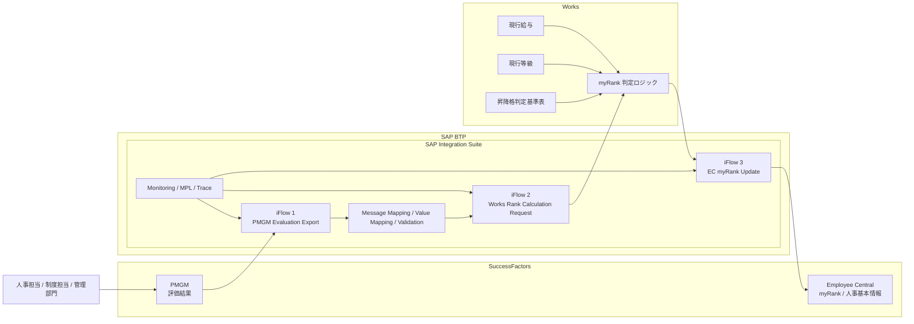

# 対日オフショア支援事例
## PMGM 評価結果を起点とした Works 連携による昇降格判定・EC 反映ケース

## 1. はじめに

本資料は、`SAP SuccessFactors PMGM` の評価結果を起点に、既存給与・等級情報および昇降格判定基準表を参照しながら、外部人事システムで等級判定を行い、その結果を `SuccessFactors Employee Central` に返却する連携案件を、日本向け顧客説明用に整理した匿名化事例です。

本事例では、`SuccessFactors` 標準のみでは完結しない日本固有の人事制度・給与制度連携を、`SAP Integration Suite (CPI)` により安定的に接続したケースとしてまとめています。

## 2. 導入背景

- お客様は日本国内で事業を展開する大手企業グループ
- 人事評価制度は `SuccessFactors PMGM` を利用して運用していた
- 一方で、給与体系、等級管理、昇降格判定基準の一部は日本国内向け人事給与システムで管理されていた
- `SuccessFactors` への刷新を進める中で、グローバル標準機能は活用する方針であったが、日本独自の給与・等級制度に関わる判定ロジックまでは一気に標準化できなかった
- 特に `ECP` はグローバル人事給与基盤として有力であったものの、日本ローカル要件への追従や既存給与制度との整合の観点から、当面は `Works` 製品を継続利用する判断となった

その結果、以下のような役割分担が必要となった。

- 評価結果の確定は `PMGM`
- 現在等級・現在給与・等級判定基準表の管理は `Works`
- 最終的な人事基本情報の保持・参照は `SuccessFactors EC`

## 3. 業務課題

本案件でお客様が抱えていた課題は、単なるデータ連携ではなく、人事制度運用に直結するものであった。

- `PMGM` 上で評価結果 (`S / A+ / A / B / C / D`) は確定できるが、それだけでは昇格・降格・据え置きの最終判定はできない
- 判定には、現行給与、現行等級、評価結果、昇降格判定基準表の組み合わせが必要
- 判定基準表は給与制度と密接に関係しており、日本側で継続利用している `Works` に保持されていた
- 人事部門では、判定結果を手作業で照合・転記する運用が残っており、集計工数と転記ミスのリスクが高かった
- 最終的な `myRank` を `SuccessFactors EC` に反映しなければ、後続の人事運用や参照業務で一貫性が取れない

## 4. 提案方針

### 4.1 ss 観点

- 本件は「単なる IF 開発」ではなく、「評価結果と処遇の関係を制度どおりに可視化・運用可能にする仕組み」として整理した
- `SuccessFactors` へ全面集約できない日本固有制度については、無理に標準化せず、現行業務を尊重した段階的連携方針を採用した
- お客様に対しては、`Works` 継続利用を前提としながらも、`PMGM - Works - EC` を一貫した流れでつなぐことで、制度運用の整合性と効率化を両立する考え方を提示した

### 4.2 jk 観点

- 評価結果連携と等級反映を疎結合に整理し、`CPI` 上で変換・ルーティング・監視を統一管理する
- 判定ロジック本体は給与制度と密接なため `Works` 側を正とし、`CPI` 側では業務責務を持ちすぎない構成とする
- `PMGM`、`Works`、`EC` の間で相関キーを明確化し、問い合わせ時に追跡可能な設計とする
- 将来的な制度変更にも耐えられるよう、判定基準の変更を `CPI` に埋め込まず、業務マスタ側で吸収する思想を取る

## 5. 案件概要

| 項目 | 内容 |
| --- | --- |
| 業界 | 日本国内向け大手企業グループ |
| 対象業務 | 人事評価結果の処遇反映、等級判定、EC 更新 |
| 対象システム | `SuccessFactors PMGM`、`SuccessFactors EC`、`Works` |
| プロジェクト全体規模 | 約 15 - 20 名 |
| 当社参画範囲 | 連携方式整理、IF 設計、CPI 開発、試験支援、ハイパーケア |
| 当社オフショア体制 | 5 名 |
| 経験者構成 | 5 名中 3 名が対日 SAP / Integration 経験あり |
| 対応期間 | 約 4 - 5 か月 |
| 主な成果物 | IF 設計書、マッピング定義、iFlow、試験仕様書、障害対応手順、運用引継ぎ資料 |

## 6. 当社オフショア体制

本案件では、少人数でありながらも、業務整理・設計・実装・試験・運用初期支援までを切れ目なく支援した。

| 役割 | 人数 | 主な担当 |
| --- | ---: | --- |
| Senior Consultant | 1 | 業務課題整理、顧客向け説明、論点整理 |
| Integration Architect | 1 | 方式設計、IF 分割方針、レビュー、技術判断 |
| Development Lead | 1 | 詳細設計、iFlow 実装方針、品質管理 |
| Developer / Tester | 2 | 実装、単体・結合試験、不具合解析 |

対日案件として重視した点：

- 日本語での設計書・質問票・課題回答
- 制度ロジックに関する説明責任
- テスト証跡と判定根拠の整合性
- ハイパーケア時の問い合わせ即応

## 7. 技術アーキテクチャ

以下は、本案件を説明するために整理した代表構成です。

## 8. アーキテクチャの考え方

### 8.1 なぜ `Works` で等級判定するのか

- 昇降格判定基準表が給与体系と結びついており、すでに `Works` 側に制度・運用が定着していたため
- `SuccessFactors` 側へすべてのロジックを移すより、まずは現行制度との整合性を優先する方がリスクが低かったため
- 日本ローカル制度対応の観点で、当面は `Works` を制度上の正として扱う方針が妥当だったため

### 8.2 なぜ `CPI` を中核にしたのか

- `PMGM`、`Works`、`EC` の間で、形式変換、項目補完、接続制御、監視を一元管理できるため
- 直接接続を避け、将来的な制度変更や接続先変更にも追従しやすいため
- エラー制御と追跡性を `CPI` 側で標準化できるため

### 8.3 なぜ判定ロジックを `CPI` に持たせすぎないのか

- 人事制度ロジックは今後も改定される可能性があり、ミドルウェアに埋め込むと保守性が低下するため
- `CPI` は連携責務に集中し、業務制度ロジックは制度側システムに寄せる方が責務分離として自然であるため

## 9. 主な技術要素

- `SuccessFactors PMGM`
- `SuccessFactors Employee Central`
- `SAP Integration Suite`
- `Cloud Integration (CPI)`
- `Message Mapping`
- `Value Mapping`
- `MPL / Trace / Monitoring`
- `Works`

## 10. オフショアチームの担当範囲

当社オフショアチームは、プロジェクト全体のうち、特に以下の領域を担当した。

- `PMGM -> Works -> EC` の IF 方式整理
- 評価結果、給与、等級、判定結果の項目整理とマッピング定義
- `CPI` による送受信 iFlow 設計・開発
- 例外処理、再送方針、監視設計
- 結合試験支援
- 本番移行後のハイパーケア支援

## 11. 実装した主要機能

- `PMGM` 評価結果エクスポート連携
- `Works` 向け等級判定リクエスト生成
- `Works` 判定結果 (`myRank`) の受信
- `EC` への等級反映
- エラー時の通知・調査ログ出力
- 制度上の不整合データに対するチェック

## 12. 設計上の主な判断記録

### 12.1 評価結果と処遇結果を分離して扱う

- 評価結果そのものと、昇降格判定後の等級結果は別概念として設計
- 元データと計算結果を混同しないよう、IF 項目も明確に分離した

### 12.2 制度ロジックの所在を明確化する

- `PMGM` は評価結果の正
- `Works` は昇降格判定ロジックの正
- `EC` は反映後の人事基本情報の参照先

このように責務を分離したことで、設計・運用の説明性を高めた

### 12.3 相関キーによる追跡性確保

- 社員番号
- 評価年度
- 評価結果確定タイミング
- 連携実行 ID

を追跡キーとして整理し、問い合わせ時に横断調査できる構成とした

### 12.4 制度変更への備え

- 等級判定基準表の変更時に `CPI` 改修を最小化できるよう、変換責務を限定した
- ミドルウェアで制度判定を持ちすぎない方針を徹底した

## 13. 開発中に直面した主な課題

### 13.1 制度用語とシステム項目のずれ

課題：
- 人事制度上の「昇格」「降格」「据え置き」「myRank」の意味と、システム項目の表現が完全には一致しなかった

対応：
- 業務用語集と IF 項目定義を対応付け
- 設計書上で業務意味とシステム値の両方を記載し、レビューを進めた

### 13.2 判定基準表の改定頻度

課題：
- 人事制度の見直しに伴い、判定基準表が微修正される可能性が高かった

対応：
- ロジックを `CPI` に埋め込まず、`Works` 側の基準表変更で吸収しやすい設計とした
- IF 項目の汎用性を確保し、将来変更に耐える構造を採用した

### 13.3 エラー時の業務影響説明

課題：
- 本件は単なるデータ連携ではなく、昇降格結果に関わるため、エラー時に人事部門への説明責任が重かった

対応：
- エラー分類を明確化
- 「再送可能」「制度確認要」「マスタ不整合」など、運用側が判断しやすい粒度で整理した

### 13.4 対日オフショアでのレビュー密度

課題：
- 日本側レビューでは、判定ロジックそのものだけでなく、設計意図、項目定義、試験ケースの根拠まで確認が入った

対応：
- 設計項目と試験ケースの対応関係を整理
- 日本語での説明補足を入れ、レビュー観点を先回りして資料化した

## 14. 達成効果

本案件では、以下のような効果をお客様に提供した。

- `PMGM` 評価結果と処遇判定の関係をシステム的に一貫して扱えるようになった
- 手作業による照合・転記を削減し、人事運用負荷を軽減した
- 日本固有の制度ロジックを維持しながら、`SuccessFactors` 刷新を進められた
- `myRank` を `EC` に戻すことで、後続人事プロセスとの整合性を確保した
- `CPI` を介して追跡性・監視性を高め、本番運用時の調査時間を短縮した

## 15. この事例で示せる対日オフショア能力

### 15.1 日本固有業務を踏まえた連携設計力

- グローバル標準と日本ローカル制度の間をつなぐ設計ができる

### 15.2 連携責務と制度責務の切り分け力

- どこまでを `CPI` で持ち、どこを業務システム側に残すべきかを整理できる

### 15.3 少人数でも説明責任を果たせる品質

- 日本語設計書、レビュー対応、試験証跡、運用引継ぎまで含めて支援できる

### 15.4 HR 領域での実務理解

- `PMGM`
- `EC`
- 給与・等級・処遇
- 日本側制度システムとの連携

を一連の業務ストーリーとして説明できる

## 16. 顧客向けメッセージ例

当社は、`SuccessFactors` 標準機能を尊重しつつ、日本固有の人事制度や給与制度との整合が必要な領域において、`SAP Integration Suite` を活用した現実的な連携設計・実装をご支援できます。

特に、`PMGM` の評価結果をそのまま保持するだけでなく、既存制度ロジックを持つ外部システムと連携し、最終的な等級結果を `EC` に反映するといった複雑な HR 連携に対しても、少人数で高品質に対応可能です。

## 17. 参考メモ

本件では、`ECP` の日本ローカル適用性そのものを否定するのではなく、当該お客様の現行制度・運用・既存資産を踏まえた結果、当面は `Works` を継続利用する判断が合理的であった、という前提で整理している。

顧客説明時には、以下のような表現が安全である。

- `ECP` より `Works` が優れている、という断定は避ける
- お客様の日本ローカル制度・既存運用・保守体制を踏まえ、現時点では `Works` 継続利用が適していた、という整理にする
