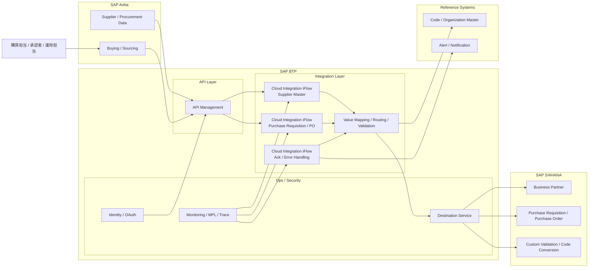

# 対日オフショア支援事例
## SAP Ariba - SAP S/4HANA 連携高度化に向けた SAP BTP / Integration Suite 活用ケース

## 1. はじめに

本資料は、当社の対日オフショア開発体制が、`SAP BTP` および `SAP Integration Suite` を活用した購買領域の連携案件において、どのように設計・開発・試験・ハイパーケアを支援できるかを説明するための事例資料です。

本事例は、実務で得た知見をもとに顧客説明用に匿名化・再構成したケースです。企業名、数値、対象範囲の一部は説明目的で調整していますが、背景、課題、体制、進め方、技術論点は実案件に即したものです。

## 2. 導入背景

- お客様は日本国内に複数拠点を持つ製造業グループ企業
- 間接材購買および一部サービス購買の効率化を目的として `SAP Ariba` を導入
- 基幹側は `SAP S/4HANA` を中心に購買、仕入先、会計連携を管理
- 既存の周辺連携は `SAP PI/PO 7.5` と個別バッチで構成されており、運用負荷と保守性に課題があった
- 新規連携や拡張を今後も `PI/PO` 側に積み増すべきか、それとも `SAP BTP / Integration Suite` に寄せるべきかを検討する必要があった

特に以下の背景が、お客様の意思決定に影響していた。

- `PI/PO` ベースの連携資産は継続利用されていたが、将来保守とクラウド活用の両立が課題になっていた
- `SAP Ariba` と `S/4HANA` の間で、標準連携だけでは吸収しきれない業務固有要件が存在していた
- 仕入先属性、購買依頼、発注、受入・請求関連データの整合性確保が重要であった
- 日本国内運用特有の承認ルール、コード体系、マスタ補完要件が存在していた

補足：
- SAP 公開情報では、`SAP Process Integration / SAP Process Orchestration 7.5` の通常保守は `2027年12月31日` まで、延長保守オプションは `2030年12月31日` までとされている
- そのため、お客様としては全面更改を急ぐというよりも、「今後の新規投資先をどこに置くべきか」を判断する段階にあった

## 3. 業務課題

本案件でお客様が抱えていた主な業務課題は以下の通りです。

- `Ariba` と `S/4HANA` 間で購買関連データのタイムリーな反映ができず、手作業確認が発生
- 仕入先情報や購買組織関連マスタの差異により、連携エラーが断続的に発生
- 発注データの補完ルールが複数存在し、どこで制御するべきかが曖昧
- 既存 `PI/PO` 連携では、障害時の調査に時間がかかり、業務部門への回答が遅れることがあった
- 新規購買シナリオ追加のたびに個別調整が発生し、設計の再利用性が低かった

## 4. 提案方針

### 4.1 Senior Consultant 観点

- 課題を「購買連携の技術刷新」ではなく、「購買業務の安定運用と可視性向上」として整理する
- `Ariba` 標準連携を前提にしつつ、日本固有の補完ロジック、コード変換、運用要件のみを追加設計する
- お客様には、単なるミドルウェア更改ではなく、「将来の段階移行を見据えた現実的な第一歩」として説明する
- 少人数でも品質担保可能な進め方を示し、対日オフショアの実行力を納得していただく

### 4.2 Architect 観点

- 新規・拡張対象は `SAP Integration Suite` を優先適用し、`PI/PO` への追加投資を抑制する
- `API Management`、`Cloud Integration`、接続先管理、監視をクラウド標準構成に寄せる
- マスタ連携、トランザクション連携、例外処理を責務ごとに分離し、将来的な保守性を高める
- `Ariba`、`S/4HANA`、周辺マスタの間で、再利用しやすいインタフェース構造を設計する

## 5. 案件概要

| 項目 | 内容 |
| --- | --- |
| 業界 | 製造業 |
| 対象業務 | 購買依頼、発注、仕入先・購買関連マスタ連携 |
| プロジェクト全体規模 | 約 18 - 25 名 |
| 当社参画範囲 | 基本設計支援、連携設計、iFlow 開発、試験支援、ハイパーケア |
| 当社オフショア体制 | 5 名 |
| 経験者構成 | 5 名中 3 名が対日 SAP Integration 実務経験あり |
| 対応期間 | 約 5 - 6 か月 |
| 主な成果物 | IF 設計書、マッピング定義、iFlow、テスト仕様書、運用手順書、課題管理表 |

## 6. 当社オフショア体制

本案件では、過度に大きな体制を組まず、役割を明確化した少人数高密度型で対応した。

| 役割 | 人数 | 主な担当 |
| --- | ---: | --- |
| Senior Consultant | 1 | 業務課題整理、対顧客説明、論点整理、進捗・課題支援 |
| Integration Architect | 1 | 全体方式設計、連携方式判断、レビュー、技術課題整理 |
| Development Lead | 1 | 詳細設計、iFlow 実装方針、品質管理 |
| Developer / Tester | 2 | 実装、テスト、障害解析、証跡整備 |

対日案件として特に重視した点：

- 日本語での設計・QA・課題回答
- 指摘事項への即時反映
- 設計変更時の影響分析
- 試験証跡と説明責任の明確化

## 7. 技術アーキテクチャ

以下は、本案件を説明するために整理した代表構成です。

## 8. アーキテクチャの考え方

### 8.1 なぜ `Integration Suite` を採用したか

- `Ariba` と `S/4HANA` 間の標準連携をベースにしつつ、固有要件を吸収しやすいため
- 新規連携を `PI/PO` に積み増すのではなく、クラウド移行を見据えた配置が可能なため
- API、変換、ルーティング、監視を一貫した方式で整理しやすいため

### 8.2 なぜ責務分離を重視したか

- 仕入先マスタと購買トランザクションでは、更新タイミングも運用影響も異なるため
- 単一 `iFlow` にすべてを詰め込むと、障害調査と変更影響の切り分けが難しくなるため
- 将来的な連携追加時に、既存設計を再利用しやすくするため

### 8.3 なぜ `API Management` を配置したか

- 接続契約、認証、公開単位を整理しやすいため
- 将来的に `Ariba` 以外の購買関連システム連携や外部 API 公開が必要になった場合にも拡張しやすいため

### 8.4 なぜ監視・追跡を前提に設計したか

- 購買領域では、1 件の連携失敗が発注遅延や支払処理遅延につながるため
- 本番問い合わせ時に、`Ariba`、`Integration Suite`、`S/4HANA` のどこで止まっているかを短時間で説明できる必要があったため

## 9. 主な技術要素

- `SAP Ariba`
- `SAP S/4HANA`
- `SAP BTP`
- `SAP Integration Suite`
- `Cloud Integration`
- `API Management`
- `Destination Service`
- `OAuth`
- `MPL / Trace / Monitoring`
- `Value Mapping`

## 10. オフショアチームの担当範囲

本案件では、当社オフショアチームは全体プロジェクトの一部として、以下の領域を責任範囲として担当した。

- 業務要件から連携要件への落とし込み支援
- `Ariba - S/4HANA` インタフェース設計
- マスタ連携・購買トランザクション連携の `iFlow` 設計・開発
- コード変換、値補完、例外処理ルールの設計支援
- 単体テスト、結合テスト、エラー解析
- ハイパーケア期間中の障害一次解析支援

このように、プロジェクト全体を過大に語るのではなく、責任を持って担当した範囲を明確にしたうえで実績化している点が、顧客説明上の信頼につながった。

## 11. 実装した主要機能

- 仕入先関連マスタ連携
- 購買依頼データの受け渡し
- 発注データの生成・更新連携
- コード変換および補完ロジック
- 連携エラー時のアラート通知
- 運用向けトレース情報出力

## 12. 設計上の主な判断記録

### 12.1 標準優先・拡張最小化

- まず `Ariba` および `S/4HANA` 標準連携で実現可能な範囲を確認
- 不足箇所のみ `Integration Suite` 上で補完

### 12.2 連携単位の分離

- 仕入先マスタ系
- 購買依頼 / 発注系
- 応答 / エラー通知系

を分けて設計し、保守性と調査性を高めた

### 12.3 コード変換の属人化回避

- 個別スクリプトに閉じ込めず、`Value Mapping` と設計書に明文化
- 変更時の影響調査を容易にした

### 12.4 本番調査性の確保

- 業務キー、購買番号、仕入先番号などを追跡キーとして整理
- `MPL` と業務問い合わせを突合できる設計とした

## 13. 開発中に直面した主な課題

### 13.1 コード体系差異の吸収

課題：
- `Ariba` と `S/4HANA` で、組織コード、購買関連コード、仕入先属性の表現が完全には一致しなかった

対応：
- 変換ルールを一覧化
- 一時対応ではなく、継続保守可能なマッピング方式に統一

### 13.2 標準連携と個別要件の境界整理

課題：
- どこまでを標準で吸収し、どこからを個別拡張で吸収するかが曖昧になりやすかった

対応：
- 業務要件、標準制約、代替案を一覧で整理
- 顧客レビューにより判断根拠を合意形成した

### 13.3 エラー時の運用負荷

課題：
- 既存運用では、エラー発生時に IT 部門が複数ログを横断確認する必要があり、回答まで時間がかかっていた

対応：
- `iFlow` ごとにエラー種別を整理
- 通知文面、調査観点、一次切り分け手順を標準化した

### 13.4 対日オフショアでの品質担保

課題：
- 日本側レビューでは、実装そのものだけでなく、説明資料、試験証跡、変更履歴の整合も厳しく見られた

対応：
- 設計差分管理を徹底
- テストケースと設計項目の対応関係を明確化
- 指摘事項を即時反映し、再説明可能な状態を維持した

## 14. 達成効果

本案件を通じて、お客様は以下の効果を得ることができた。

- `Ariba` と `S/4HANA` の購買連携における整合性向上
- 手作業確認と障害一次切り分け工数の削減
- 標準を活かしつつ固有要件を吸収する拡張方針の確立
- 新規投資を `PI/PO` ではなく `BTP / Integration Suite` に寄せる移行準備の前進
- 少人数オフショアでも、設計・実装・試験・ハイパーケアまで一貫して支援可能であることの実証

## 15. この事例で示せる対日オフショア能力

### 15.1 業務理解を伴う連携提案力

- 単なる IF 開発ではなく、購買業務課題と導入効果を結び付けて説明できる

### 15.2 現実的なアーキテクチャ設計力

- `PI/PO` の現状を踏まえつつ、無理のない `BTP / Integration Suite` 活用方針を提示できる

### 15.3 少人数でも成立する品質管理

- 5 名規模でも、役割分担、レビュー、証跡管理により対日品質を確保できる

### 15.4 実装から運用までの一貫支援

- 設計、開発、試験、障害解析、ハイパーケアまで切れ目なく対応できる

## 16. 顧客向けメッセージ例

当社は、対日オフショア体制として、過大な体制や実績を強調するのではなく、実際に責任を持って対応可能な範囲を明確にご説明します。

特に、`SAP Ariba` と `SAP S/4HANA` の連携高度化や、`PI/PO` 更改を見据えた `SAP BTP / Integration Suite` 活用をご検討中のお客様に対して、以下の価値をご提供できます。

- 標準を尊重しつつ、固有要件だけを適切に補完すること
- 将来移行を見据えた、無理のないクラウド連携方針を整理すること
- 少人数でも日本向け品質で、設計・実装・試験・運用支援を安定して実行すること

## 17. 参考情報

本資料内の `PI/PO 7.5` 保守期限に関する記述は、SAP の公開情報に基づく。

- SAP Community: Maintenance strategy for SAP NetWeaver 7.5 fully aligned with SAP Business Suite 7
  - https://community.sap.com/t5/technology-blog-posts-by-sap/maintenance-strategy-for-sap-netweaver-7-5-fully-aligned-with-sap-business/ba-p/13456253
- SAP Learning: Understanding the Rationale for a Migration
  - https://learning.sap.com/courses/sap-process-orchestration-to-sap-integration-suite-migration/understanding-the-rationale-for-a-migration

補足：
- 上記公開情報から、本資料では `SAP Process Integration / Process Orchestration 7.5` の通常保守を `2027年12月31日`、延長保守を `2030年12月31日` として記載している
